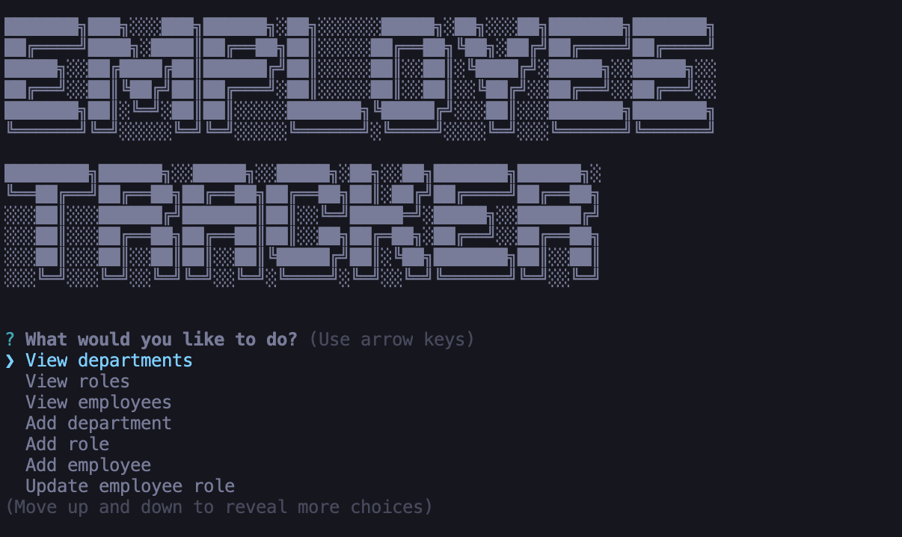

# Employee-Tracker

This Node application allows users to interact with an Employee Tracker database, allowing users to:

- View all departments
- View all employees
- View all roles
- Add a new department
- Add a new role
- Add a new employee
- Update an existing employee's role

## Screenshots



## Installation and Start Up

To install, `git clone` the repository and run `npm install` to install dependencies.

You must have MYSQL on your computer to use this application. Open up a connection to MYSQL in the root directory and run:

```MYSQL
source db/db.sql
source db/schema.sql
source db/seeds.sql

```

You must also create a .env file and add the password as described in .env.EXAMPLE.

## Technologies

This app uses Node.js, MYSQL, Express, and Inquirer to prompt the user and save their responses. A package called console.table is used to display data from the database.
